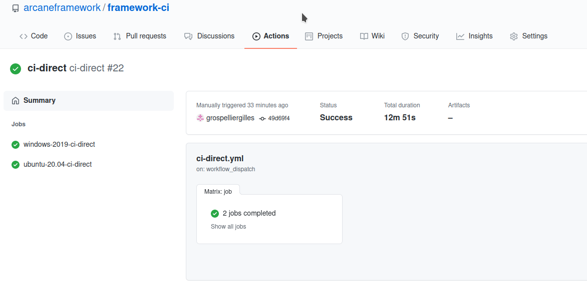

# README

Ce dépot contient les scripts pour l'intégration continue (CI) de Arcane.

- [README](#readme)
- [Compilation des packages](#compilation-des-packages)
- [Images Docker](#images-docker)
  - [Les types](#les-types)
  - [Les tags](#les-tags)
  - [Images disponibles](#images-disponibles)
- [Workflows](#workflows)
  - [install\_vcpkg\_packages](#install_vcpkg_packages)
  - [ci-direct](#ci-direct)
  - [image\_creator](#image_creator)
- [Utilisation de 'Github CLI'](#utilisation-de-github-cli)
- [TODO](#todo)

Actuellement, le CI utilise le mécanisme de 'GitHub', appelé 'GitHub
Actions'. Ce mécanisme utilise des scripts au format YAML qui sont dans
le répertoire `.github/workflows`. Il y a un script par action
possible. Il est possible d'accéder aux actions via l'interface WEB de
git en cliquant sur l'onglet 'Actions' sous le nom du dépot:

Le CI fonctionne à la fois sous windows et linux

Afin d'éviter d'être dépendant de produits externes et d'être portable
entre les plateformes, le CI utilise uniquement des scripts CMake.

# Compilation des packages

Actuellement pour avoir la même configuration entre windows et linux
(ubuntu), on utilise [vcpkg](https://vcpkg.io) pour installer les
packages nécessaires à Arcane. 

L'utilisation classique de `vcpkg` suppose qu'on en fasse un
sous-module dans notre dépot. On utilise donc `vcpkg` à une version
donnée, ce qui implique aussi d'avoir une version donnée des packages
(il n'est pas possible actuellement dans vcpkg d'avoir plusieurs
versions d'un même produit). Tant qu'on ne met pas à jour ce
sous-module, les versions installées des produits seront les mêmes. Il
est préférable d'utiliser une version taggé de `vcpkg`. 

Après avoit fait un checkout du sous-module, il faut lancer la
commande `bootstrap.sh` ou `bootstrap.bat` pour compiler `vcpkg`. Cela
va créer un exécutable `vcpkg` dans les sources de ce sous-module. Il
est ensuite possible d'installer un package via des commandes telles
que: 

~~~sh
vcpkg install glib
~~~

Les produits installés par `vcpkg` sont mis dans le sous-répertoire `installed` du dépot.

NOTE: Sous Linux, `vcpkg` utilise des bibliothèques statiques
(`.a`). Sous windows, il utilise des bibliothèques dynamiques (DLL).

# Images Docker
## Les types

Actuellement, il y a trois types d'images possibles :
- **minimal** : contient le minimum de packages pour pouvoir utiliser
  Arcane.
- **full** : contient le maximum de package pour pouvoir utiliser le
  maximum des fonctionnalités d'Arcane. Dépend de **minimal** pour être
  construite.
- **doc** : contient les packages nécessaires pour compiler la
  documentation. Dépend aussi de **minimal** pour être construite.

## Les tags

Il y a quatre types de tags :
1. Dernière version du compilateur (exemple : `gcc_full_latest`)
2. Version du compilateur au choix (exemple : `gcc-12_full_latest`)
3. Versions des compilateurs de l'image au choix 
   (exemple : `gcc-12_clang-14_full_latest`)
4. Versions des compilateurs de l'image au choix, avec date de création 
   (exemple : `gcc-12_clang-14_full_20220617`)

Cela permet de choisir le niveau de stabilité voulu selon l'utilisation faite
de l'image.

Le tag `1.` permet d'avoir la dernière version du compilateur.
C'est l'image qui sera le plus souvent mise à jour. Par exemple, si vous
compilez Arcane et que vous vous fichez de la version de `gcc` ou de `clang`,
ce tag convient.

Le tag `2.` permet de choisir une version majeur de compilateur. Si la
version du compilateur importe pour vous, ce tag convient.

Le tag `3.` est lié à la façon dont on crée les images. En effet, pour
éviter de multiplier les images, on réunit plusieurs compilateurs dans
la même image. Ce tag présente donc l'ensemble des compilateurs C/C++
présents dans l'image, avec leurs versions. Ce tag permet d'être sûr
des compilateurs présents dans l'image et peux vous être utile si vous
souhaitez tester plusieurs compilateurs en même temps.

Le tag `4.` est le plus stable. En effet, il permet de choisir une image
qui ne changera jamais (sauf si plusieurs images sont générées le même
jour, dans le cas de hotfix par exemple). Si vous souhaitez avoir le même
environnement de travail, les mêmes versions des outils en permanance
(pour reproduire des bugs par exemple), ce tag convient.

Attention néanmoins, aujourd'hui, les images créées contiennent plusieurs
compilateurs. Par exemple, si vous choisissez le tag `gcc_full_latest`,
vous aurez aussi le compilateur `clang`. Mais c'est quelque chose qui peut
être amené à changer.

## Images disponibles

Pour voir directement toutes les images disponibles ou pour les dates de
création, voir dans la partie "Package".

Voici les images disponibles :
- `ubuntu-2204:`
  - `gcc`
  - `clang`
  - `cuda`
  - `gcc-12`
  - `clang-14`
  - `clang-15`
  - `cuda-117`
  - `cuda-118`
  - `gcc-12_clang-14`
  - `gcc-12_clang-15`
  - `gcc-11_clang-13_cuda-117`
  - `gcc-11_clang-13_cuda-118`
    - `_full_latest`
    - `_minimal_latest`
 
- `ubuntu-2004:`
  - `gcc`
  - `clang`
  - `cuda`
  - `gcc-11`
  - `clang-13`
  - `clang-14`
  - `clang-15`
  - `cuda-116`
  - `cuda-118`
  - `gcc-11_clang-13`
  - `gcc-11_clang-14`
  - `gcc-11_clang-15`
  - `gcc-11_clang-12_cuda-116`
  - `gcc-11_clang-13_cuda-118`
    - `_full_latest`
    - `_minimal_latest`

Exemples :
- `ubuntu-2204:clang-14_full_latest`
- `ubuntu-2004:gcc_minimal_latest`

 

Pour générer la documentation, voici l'image actuellement disponible :
- `ubuntu-2204:gcc_doc_latest`

L'image de génération de documentation n'est utile que pour générer
la documentation, il n'y a donc qu'un tag recommandé. Les autres tags
peuvent ne plus fonctionner du jour au lendemain. En revanche,
lorsque l'on change d'OS pour ce type d'image, l'ancienne image perdurera
(mais ne sera plus forcement mise à jour).
En bref, le tag `gcc_doc_latest` fonctionnera toujours mais la version
de gcc n'est pas connu.

# Workflows

Les workflows disponibles sont:

- install_vcpkg_packages.yml
- ci-direct.yml
- image_creator.yml

## install_vcpkg_packages

Ce workflow permet de compiler (via `vcpkg`) les packages nécessaires
et de les publier dans le 'GitHub Packages' sous la forme de packages
Nuget. Il ne faut le lancer que si cette liste de package change ou si
on a mis à jour la version de `vcpkg`.

La variable `VCPKG_PUSH_HASH_PACKAGE_NAME` du workflow indique le nom
du package Nuget qui contiendra les produits installés. Il faut donc
incrémenter le numéro de version de cette variable si on fait évoluer
la liste des packages installés ou leur version. A noter qu'il n'est
pas possible avec Nuget de re-publier un packages existant avec le
même nom.

l'étape 'Install vpckg packages' de ce workflow est celle qui installe
les packages nécessaires pour Arcane. C'est dans cette étape qu'on
spécifie la liste des packages à installer.

Après la compilation et l'installation des packages, on utilise le
script `_build/vcpkg_cache/DoTar.cmake` pour publier les packages. Ce
script fait un tar du répertoire contenant `vcpkg` et les produits
installés et le publie sous la forme d'un package nuget.

NOTE: normalement `vcpkg` dispose d'un mécanisme interne pour faire
tout cela automatiquement mais cela ne fonctionne pas bien sous Linux
(TODO: ajouter références aux bugs) pour certains packages.

Pour éviter entre deux exécutions du workflow d'avoir à tout
recompiler (par exemple si on ajoute juste un package), on ajoute une
étape en début du workflow pour récupérer une ancienne version des
packages, dont le nom est donné par la variable
`VCPKG_PREINSTALL_HASH_PACKAGE_NAME`. Cette étape exécute le script
`_build/vcpkg_cache/DoUntar.cmake` pour faire cela.

## ci-direct

Le workflow `ci-direct` est celui qui permet de compiler Arcane en
même temps que les composantes Arccon, Arccore et Axlstar. Ce workflow
se lance manuellement et il est possible de spécifier lors du
lancement la branche ou le tag du dépot Arcane à utiliser (par exemple
`dev/cea`, `dev/ifen` ou `main`).

Ce workflow va d'abord récupérer une version des packages installés
par `vcpkg`. La variable `VCPKG_INSTALL_HASH_PACKAGE_NAME` permet de
spécifier cela. Elle doit correspondre à une version installée via le
workflow `install_vcpkg_packages` (et spécifiée par la variable
`VCPKG_PUSH_HASH_PACKAGE_NAME` de ce workflow). C'est le script
`_build/vcpkg_cache/DoUntar.cmake` qui effectue cette action.

Ensuite, le workflow effectue le configure de Arcane et la
compilation. La configuration se fait de manière classique (via cmake)
mais on ajoute deux variables:

- CMAKE_TOOLCHAIN_FILE qui contient le fichier cmake utilisé par
  `vcpkg` pour se configurer
- VCPKG_INSTALLED_DIR qui contient le répertoire ou sont installés les
  packages de `vcpkg`.

La variable cmake VCPKG_INSTALLED_DIR permet de spécifier le
répertoire où `vcpkg` a installé les produits. En spécifiant dans
cmake une toolchain spécifique pour `vcpkg`, c'est ce dernier qui va
gérer automatiquement les variables nécessaire pour rechercher les
packages (par exemple fait la distinction entre les packages de debug
et optimisées). Sous windows, `vcpkg` va aussi automatiquement
recopier dans le répertoire de l'exécutable les DLLs nécessaires à son
exécution (mais uniquement les DLLs associées à des packages installés
par `vcpkg`).

## image_creator

Ce workflow permet de construire des images Docker contenant le
nécessaire pour compiler, installer et lancer Arcane.

Les Dockerfiles et leur workflow se trouvent dans différentes branches.
En effet, il y a plusieurs versions du même workflow `image_creator`.
Ces branches dédiées ont un nom ayant la structure suivante :
`image/os-versionos/compilo1-version1_compilon-versionn_type`

Exemples :
- `image/ubuntu-2004/gcc-11_clang-14`
- `image/ubuntu-2204/gcc-12_clang-15`

Comme on peut le voir dans les exemples ci-dessus, chaque branche
est dédiée à un couple "os/compilos".

Si l'on veut générer une image spécifique, on doit aller dans la partie
"Actions", choisir le workflow "Image Creator", cliquer sur "Run workflow"
et choisir la branche correspondante au couple "os/compilos" voulu.

Si l'on veut ajouter une nouvelle version de compilateur, pour un OS donné,
il faut impérativement supprimer le tag `compilo_type_latest` des yamls
ayant l'ancienne version du compilateur (vu que les anciennes versions
du compilateur ne représentent plus la nouvelle version...).

Voici la procédure précise (l'exemple présente la mise à jour du compilateur
`clang` de la version `14` à la version `15` de l'OS `ubuntu-2204`) :
1. Checkout la/les branche(s) avec la version `clang-14`,
2. supprimer les tags `clang_minimal_latest` et `clang_full_latest`,
3. créer une autre branche à partir de la branche la plus récente avec
   `clang-14`,
4. modifier ce qu'il faut dans les Dockerfiles et dans le yaml,
5. ajouter les tags `clang_minimal_latest` et `clang_full_latest`,
6. générer l'image avec le workflow "Image Creator".

Les images sont accessibles dans la partie "Package" de ce dépôt.

# Utilisation de 'Github CLI'

Il existe une version en ligne de commande (CLI) pour appeler l'API
GitHub: [GitHub CLI](https://github.com/cli/cli). Il est possible de
récupérer et d'installer cet outil. Une fois configuré, il est
possible de se placer directement dans ce dépot et de lancer le
workflow via une commande telle que:

~~~sh
# Lance le workflow 'ci-direct' sur la branche 'dev/cea' du framework Arcane
gh workflow run ci-direct.yml -f framework_branch=dev/cea
~~~

Cet outil permet de faire beaucoup plus de choses comme suivre les
workflow, faire des 'pull request', ...

# TODO

- [ ] Ajouter l'exécution de plus de tests (par exemple des tests parallèles)
- [ ] Regarder pourquoi l'installation séparée ne fonctionne pas.
- [ ] Sous windows, recopier les DLLs dans les répertoires des
  exécutables pour que les tests Arcane fonctionnent (les tests
  arccore fonctionnent bien car ils ne dépendent que de packages
  instalés par `vcpkg` et ce dernier gère la copie).